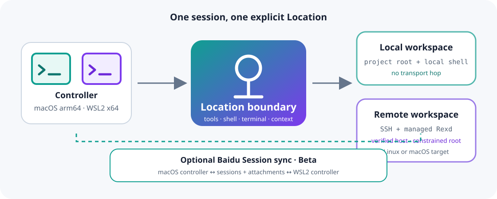

<p align="center">
  <picture>
    <source srcset="docs/assets/transit-logo-dark.svg" media="(prefers-color-scheme: dark)">
    <source srcset="docs/assets/transit-logo-light.svg" media="(prefers-color-scheme: light)">
    
  </picture>
</p>

<p align="center"><strong>让编码会话留在手边，即使工作区在另一台机器上。</strong></p>

<p align="center">
  <a href="README.md">English</a> ·
  <a href="README.zh.md">简体中文</a>
</p>

> [!IMPORTANT]
> OpenCode Transit 是基于 [OpenCode](https://github.com/anomalyco/opencode) 构建的独立项目。它并非由 OpenCode 团队开发、认可或维护，与 OpenCode 团队也不存在隶属关系。

<p align="center">
  <a href="https://github.com/hammershock/opencode-transit/actions/workflows/typecheck.yml"></a>
  <a href="LICENSE"></a>
  <a href="#平台支持"></a>
  <a href="#功能状态"></a>
</p>

<p align="center">
  
</p>

OpenCode Transit 把终端编码 Agent 变成围绕 Location 工作的工具。只需选择一次本地工作区或 SSH 主机，Agent 工具、Shell 补全、终端、项目指令和会话恢复都会持续绑定到这个明确的 Location。可选的百度会话同步还能让你在自己的 Mac 与 WSL2 控制端之间继续同一段对话。

## 为什么选择 Transit

- **从头到尾只有一个明确 Location。** QuickStart 选择本地或 SSH 后，所有与工作区有关的操作都会遵循同一个目标与工作目录。远程失败绝不会静默回退到控制机文件系统。
- **通过 SSH 托管 [Rexd](https://github.com/samiralibabic/rexd)。** Transit 会校验 SSH 主机、准备或复用兼容的 Rexd 运行时，并把访问约束在选定的工作区根目录。
- **会话记得自己属于哪里。** Location 身份会持久化。目标消失时历史仍然可读，重新绑定则是明确的恢复动作。
- **上下文可以检查。** 模型会得到真实的目标平台、项目规则和选定 Skills；`/context` 可以查看该会话冻结的上下文来源。
- **围绕真实终端工作的 TUI。** 包括感知 Location 的 bash/zsh 补全、连续 Shell 模式、清晰的 `target · cwd`、可信命令解析，以及统一管理 OpenCode、Codex、Claude 与自定义 Skills 的入口。
- **跨设备会话同步——Beta。** 百度同步可在 Mac 与 WSL2 间传递完整会话和附件，支持离线发件箱与 remove-wins 删除；它不负责同步工作区、Git 仓库、配置、目标、凭据或通用 UI 状态。

## Rexd 依赖

本地工作区不依赖 Rexd。SSH 远程 Location 使用 [samiralibabic/rexd](https://github.com/samiralibabic/rexd)：一个实现 REXD v1 JSON-RPC 协议的轻量远程执行与文件系统平面。Transit 会固定兼容版本、验证其 SHA-256 摘要，再通过 SSH 准备或复用它，因此用户通常不需要手动安装 Rexd。

Rexd 是采用 [MIT 许可证](https://github.com/samiralibabic/rexd/blob/main/LICENSE)独立维护的项目。感谢其维护者与贡献者为 Transit 提供远程执行基础。

## 快速开始

Transit 目前从源码交付。独立的 `opencode-transit` 入口不会覆盖已安装的上游 `opencode` 命令。请先安装 [Bun](https://bun.sh/docs/installation) 与 Git，再选择控制端对应的命令。

### macOS Apple Silicon

```bash
git clone https://github.com/hammershock/opencode-transit.git
cd opencode-transit
bun install --frozen-lockfile
cd packages/opencode
bun run script/transit-build.ts --single --skip-install
./script/install-transit \
  --binary dist/opencode-darwin-arm64/bin/opencode-transit \
  --manifest dist/opencode-darwin-arm64/bin/opencode-transit.build.json
opencode-transit
```

### Windows + WSL2（Ubuntu x64）

请在 WSL2 内运行以下命令，不要使用 PowerShell 或命令提示符：

```bash
git clone https://github.com/hammershock/opencode-transit.git
cd opencode-transit
bun install --frozen-lockfile
cd packages/opencode
bun run script/transit-build.ts --single --skip-install
./script/install-transit \
  --binary dist/opencode-linux-x64/bin/opencode-transit \
  --manifest dist/opencode-linux-x64/bin/opencode-transit.build.json
opencode-transit
```

在项目目录启动，在 QuickStart 中选择 **Local** 或 **SSH** 目标，然后进入 TUI。几个常用命令：

| 命令        | 用途                                   |
| ----------- | -------------------------------------- |
| `/target`   | 管理执行目标并测试连接                 |
| `/context`  | 查看目标、指令与模型上下文来源         |
| `/skills`   | 发现并控制本地或远程使用的 Skills      |
| `/env list` | 查看 Location 环境来源，但不显示变量值 |
| `/sync`     | 配置或查看百度会话同步                 |

构建元数据、自定义安装目录、签名与 `opencode-rexd` 兼容入口请参阅[开发入口指南](docs/development/opencode-transit.md)。

## 平台支持

| 控制端                        | 本地工作区         | SSH + 托管 Rexd    | 状态                               |
| ----------------------------- | ------------------ | ------------------ | ---------------------------------- |
| macOS Apple Silicon（arm64）  | 是                 | 是                 | 支持                               |
| Windows WSL2、Ubuntu x64      | 是                 | 是                 | 支持                               |
| 原生 Windows                  | 否                 | 否                 | 不支持，请使用 WSL2                |
| Intel Mac 或通用 Linux 控制端 | 不在公开支持契约内 | 不在公开支持契约内 | 可能存在构建路径，但未经发布级验证 |

远程 Rexd 工作区可运行在兼容的 Linux 或 macOS SSH 目标上。Transit 不是云调度器，Rexd 也不是主机沙箱。

## 功能状态

| 能力                                         | 状态                     | 边界                                             |
| -------------------------------------------- | ------------------------ | ------------------------------------------------ |
| 本地与 SSH Location、托管 Rexd               | 可用                     | 远程使用需要可访问且可信的 SSH 主机              |
| 感知 Location 的工具、终端、上下文与会话恢复 | 可用                     | 目标丢失后的重新绑定是显式动作                   |
| Skill 管理与结构化 `$skill` 调用             | 可用                     | Skill 启用状态保存在设备本地，包不会通过云端同步 |
| 百度会话同步                                 | **Beta**                 | 使用用户自己的百度应用凭据；没有应用层端到端加密 |
| Location `.env` 来源与 Shell `cwd` 连续性    | **Experimental**         | 选择性启用的设备本地设置                         |
| 模型页脚中的 Provider 用量                   | 支持相应 Provider 时可用 | OpenAI Codex OAuth 用量为 **Experimental**       |

## 先了解这些边界

- **远程访问能力很强，但不等于隔离。** Agent 可以使用本地账户或 SSH 账户获准访问的文件与 Shell。需要安全边界时，请使用容器、虚拟机或受限账户。
- **工作区根目录检查不是主机沙箱。** 托管 Rexd 会约束 Transit 暴露的工作区，但不会把远程操作系统账户变成隔离租户。
- **同步没有由 Transit 提供端到端加密。** 百度负责传输存储的会话数据。请使用自己的百度应用凭据，不要把同步当作秘密保险箱。
- **Transit 与上游 OpenCode 共用内部命名空间。** 配置与数据格式仍然紧密相关；不要因为可执行文件名称不同，就认为两套安装完全隔离。
- **持久化能力有明确边界。** 已接纳的输入与 Location 绑定会持久化，但进程崩溃中断的 Provider 工作不会自动重试。

## 文档与帮助

- [OpenCode Transit 开发与安装](docs/development/opencode-transit.md)
- [发布制品与来源证明](docs/development/transit-release.md)
- [开发工作流](docs/development-workflow.md)与[测试工作流](docs/testing-workflow.md)
- [架构 RFC 索引](docs/rfcs/README.md)
- [Issue Tracker](https://github.com/hammershock/opencode-transit/issues)：提交缺陷与聚焦的功能建议
- [上游 OpenCode 文档](https://opencode.ai/docs)：了解共用的基础 Agent 与配置模型

## 参与贡献

提交 Issue 或 Pull Request 前请阅读[中文贡献指南](CONTRIBUTING.zh.md)。Fork 开发以 `dev` 为目标分支，使用与 Issue 对应的聚焦分支，并明确记录设备验证情况。

## 安全

请通过[中文安全策略](SECURITY.zh.md)中的私密渠道报告漏洞，不要公开提交 Issue。

## 上游项目与许可证

Transit 得以存在，离不开 [OpenCode 项目](https://github.com/anomalyco/opencode)、[Rexd 项目](https://github.com/samiralibabic/rexd)及其贡献者的工作，我们在此感谢两个上游社区。OpenCode 的版权声明与本仓库的 [MIT 许可证](LICENSE)继续保留；Rexd 仍是采用 MIT 许可证独立维护的依赖。Fork 专属改动由 OpenCode Transit 项目独立维护。
